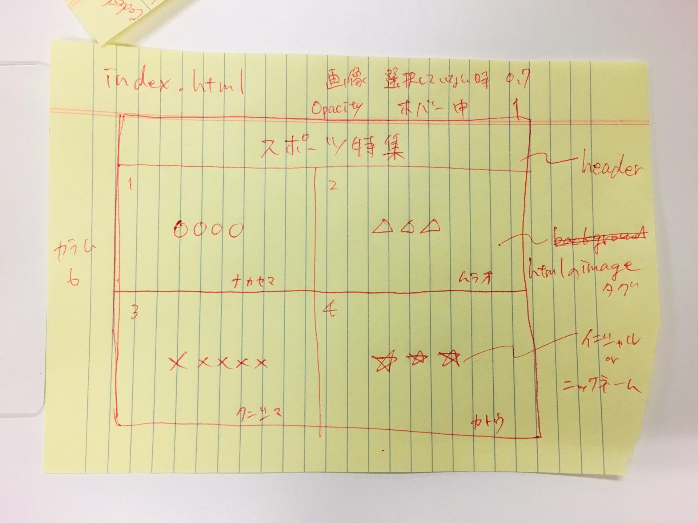
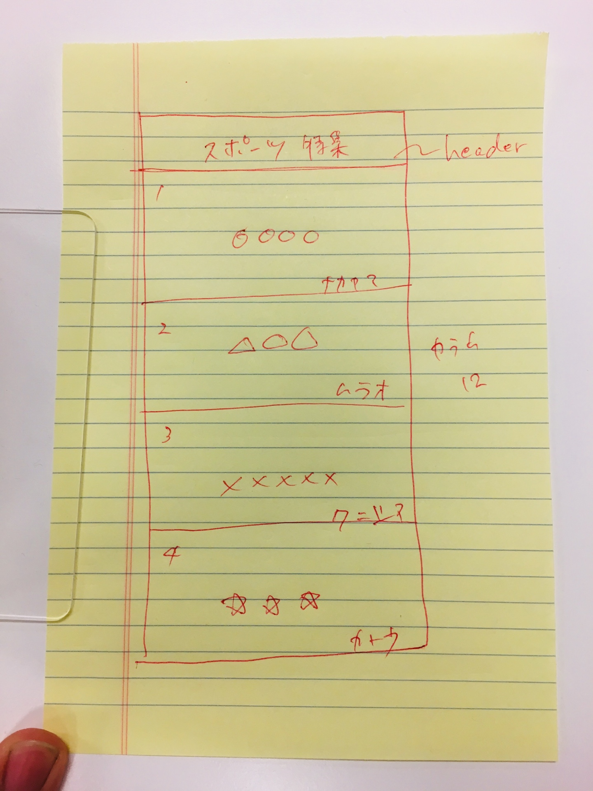
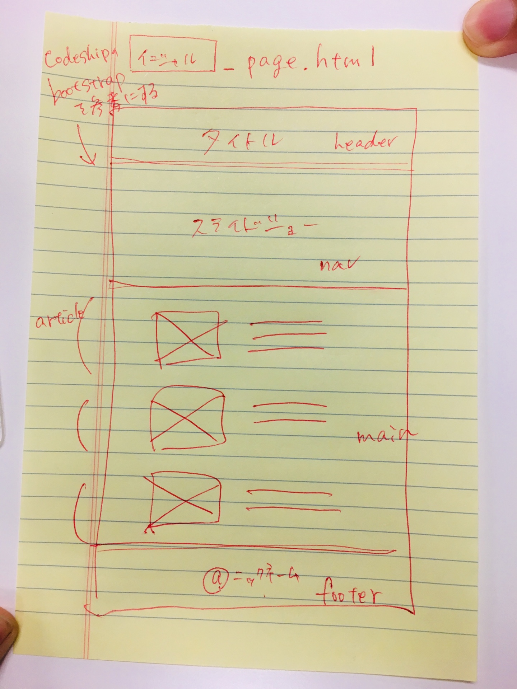

# スポーツ特集

## 参加者

- 参加者名 スポーツ イニシャル
- 加藤さん ダンス tk\_
- 村尾さん 空手 tm\_
- 中山さん ソフトテニス kn\_
- 國嶋さん 剣道 yk\_

## デザイン

- bootstrap
- font awesome

## class の命名規則

人毎に自分のイニシャルを固有の記号として先頭につけて class を定義する。
例えば、ts_menu-item

## class の命名規則

[Qiita](https://qiita.com/manabuyasuda/items/dbb76ed36970bec95470)

## CSS リセット

Normalize.css

## Web サイトのラフスケッチ

## 担当

- 加藤さん tk_page.html
- 村尾さん 空手 tm_page.html
- 中山さん ソフトテニス kn_page.html
- 國嶋さん 剣道 yk_page.html
